# Simple To-Do List

## A To-Do List Web Appication
Simple To-Do List is a JavaScript web app that is a simple yet effective way to track tasks that need to be done and can be easily used by anyone for any tasks. It is simple by design for 2 reasons: 
 - A To-Do list is something that does not need to be overly complicated. The focus should be on the tasks that need completeing.
 - It can be easily used by anyone, regardless of technical ability.

The purpose of this app is to allow a user to easily keep track of tasks that they need to complete, see the tasks they have completed and get a sense of accomplishment from the "ding" after each task completion. They can see scores which indicate the tasks remaining, the completed tasks and the number of priority tasks.

#### Live site: https://semmtm.github.io/todo-list/
#### Repository: https://github.com/SemMTM/todo-list

### By Osama Hendawi

## Table of Contents
1. UX
2. Features
3. Future Features
4. Technology Used 
5. Testing
6. Bugs
7. Credits
8. Deployment

## 1. UX
### 1.1. Pre-project Planning
For project 2 I decided I wanted to challenge myself and create something that wasn't in one of the suggested projects. I came to the idea of a to-do list as this is something I use regularly and it would really test my abilities with JavaScript as I have not done anything like this previously.

There were a few key project goals:

- Have a due date and priority tasks feature
- Counters to show remaining tasks
- Save task data locally so the user does not have to re-enter their tasks each time 

### 1.2. UX Design
In terms of user experince, I really wanted to keep things as clean as possible. I wanted the task list to be efficient, easy to use, clean and organised for the user. I wanted the colours to be more neutral and not distracting, I wanted a font that would be easily legible and poisitve feedback for task completion. Some other considerations were:  

- There had to be a clear distinction between completed and incomplete tasks
- Priority tasks had to be obvious 
- Simplicity was to be the main priority in terms of design

## 1.3. User Stories 
### 1.4. User
- First Time Visitor Goals
  - As a first time visitor, I want to know how to use the app easily.
  - As a first time visitor, I want to be able to easily navigate the app.
  - As a first time visitor, I want to add a task quickly.

- Returning Visitor Goals
  - As a returning visitor, I want to be able to see my previously added tasks

- General User Goals
  - As a user I want to be able to keep an organised list of tasks that need doing
  - As a user I want to be able to set due dates for important tasks that need doing first. I also want a clear indication of when these tasks are due and how long I have left to complete them
  - As a user I want to be able to mark tasks as priority
  - I want to be able to delete tasks and mark them as complete

## 1.5. Wireframes
### 1.6. Desktop & Mobile Wireframes

## 2. Features
### Adding Tasks to the Task List
- A large text input field that allows the user to enter a new task to add to the 'incomplete' task list.

- An error is displayed if the field is left empty.

- When a task is entered, the DOM is then updated with the task that the user entered. It is added to a 'incomplete tasks' list. These tasks can be added by clicking 'add' or by pressing enter. Once the task has been added, the 'add a task' field is cleared.

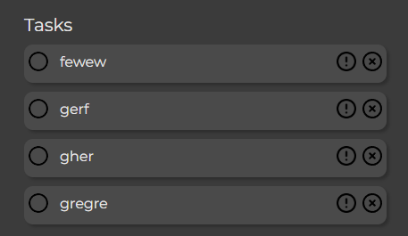

- A cursor pointer is shown when a task is hovered over.

### Task Completion and Task Delete

- Tasks can be marked as completed by clicking anywhere on the task. Once a task is marked as complete, it is moved to a 'completed' list and moved to the bottom of the list for organisation. Tasks marked as complete are also lined through, greyed out, the circle is filled in and a 'ding' sound is played to add a sense of acomplishment at your recently completed task.

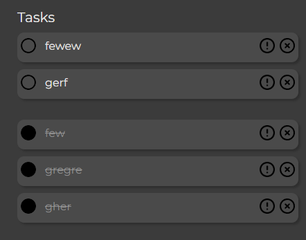

- Tasks can also be unchecked. Once a task is unchecked, it is added to the bottom of the incomplete task list. The score also updates accordingly.

- Tasks can be completely deleted by pressing a small 'x' on the side of every task. A pop up will then appear asking the user if they want to delete the task. if they press 'Delete Task' then then this will completely delete the specific task from any list it was on and update the score accordingly.

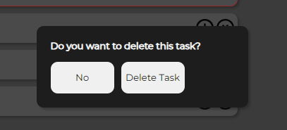

### Priority Tasks & Set Due Date
- After pressing the exclamation point button, a pop-up will appear. This pop-up asks the user if they wish to set a due date. The reason I have implemented this feature in such as way is that I wanted to allow the user to set priority tasks, as well as a due date and I did not want to add another separate button. This would cause the to do list to become overly cluttered and would not align with keeping it as clean as possible.

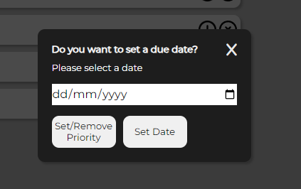

- Tasks can be marked as priority by selecting the 'Set/Remove Priority' in the pop up. When tasks are marked as priority, they will be moved to the top of the task list, added to the 'priority tasks' counter and outlined in red.

- To implement this feature I had to give every task a uniquely generated TaskId, this Id had to be saved locally so no duplicate IDs were produced after browser refresh. I then took the ID from the task, parsed it to the ! button when pressed, then parsed it from the ! button to the Set/Remove priority button. I then take this ID from the data attribute on the button and use it to select the task with the matching ID. 
- This process was used for date setting, task delete and task priority features.

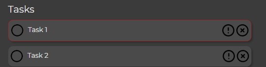

- The user can also select a date and click 'set date'. A due date will appear below the task. This date has been formatted to be more readable for the user.

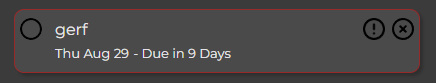

- This due date counter updates as the due date gets closer and the message changes depeneding on if the task is overdue or due soon. The colour of the due message will change depending on how close the due date is.

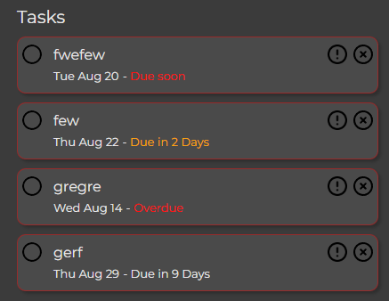

- If no date is selected and the user hits 'set date', then they will recieve an error message.

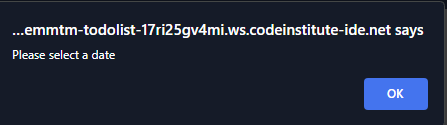

- To implement this live due date tracker, I had to use a for loop to iterate through all of the tasks in the 'incomplete' tasks list. It would then check the user set date and compare it to todays date. Different actions will then be called depending on how close or far the due date is.

### Tasks Score

- A score tracker updates when tasks are added, marked as complete or marked as priority. This helps the user easily see how many tasks are remaining and how many they have completed.

- If a task is deleted from either list, then the tracker updates.

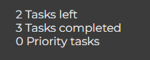 

### Editable Title

- The title of the to do list is editable by the user so they can make it their own. 
- If the field is empty, then a default 'My To-Do List' title is used.

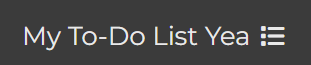

### Save Data Locally 

- Remaining tasks and the custom title name are saved to the browser locally so that a user can return to their tasks without needing to retype everything.

- Completed tasks are not saved so the list is tidyed up when the user next returns.

- Any action a user takes will be saved locally.

### Response To The User

- Almost every interaction a user makes with the To-Do list provides some sort of feedback. Most notibly, when a task is marked as complete a 'ding' sound will play. The purpose for this is to invoke a strong positive response from the user and encourange them to add and complete more tasks.

## 3. Future Features
- The ability to create additional lists for seperate groups of tasks 
- Reorder tasks via click and drag or drag and drop

## 4. Technology Used
### HTML
> Used to structure my webpage.

### CSS
> Used to style and layout the To-do List.

### JavaScript
> Used to add all of the interactivity to the site, update the DOM based on what action the user takes on their tasks, update the live counter, add the due dates, set priority tasks etc.

### Font Awesome
> Used for the title icon.

## 5. Testing 
### 5.1. General Testing

Testing Table (Click to expand)

| What we are testing | How we test it | What we expect to happen | Result |
|--|--|--|--|
| Website is responsive on different viewport sizes | Open app on different size screens | Site is responsive | Pass |
| Loads correctly on multiple browsers | Load app on multiple browsers (Opera, Chrome and Safari) | App loads with no issues | Pass |
| All text is legible on different screen sizes and pages | Open app on mobile and desktop | All text sizing is correct | Pass |
| All forms have client side validation and need information before they can be submitted | Submit forms with no information entered | A please enter x alert | Pass |
| Tasks are added to the list on button click or enter press | Enter a new task and press "Add" or enter | Task is added to the to do list | Pass |
| Unique task IDs are generated correctly and saved | Create a few tasks, refresh the page, add more tasks, refresh again, then check all task ids to see if they are unique | Unique task IDs are generated and dont reset after refresh | Pass |
| Task ID parsing to selected elements on function call | Add a task, press the "!" button, the use inspect element to check the data attribute on the "!" button, the delete button and the "Set/Remove Priority" Button. | Task IDs are parsed to the correct elements | Pass |
| Tasks counter updates when tasks sate changes | Add a few tasks, mark them as complete, delete some, and mark some as priority | Task counter updates accordingly | Pass |
| Correct task is deleted when delete is pressed | Delete a task | Selected task is deleted | Pass |
| Task are put into the correct list depending on if they have been marked as complete or not | Mark a task as complete | It is moved to the "completed" task list | Pass |
| Local data save and retrieval work | Add a few tasks and refresh the browser. Check tasks are there after refresh, check counter and task IDs | Everything saves and retreives as expected | Pass |
| Task complete notification plays when a task is marked as complete | Mark a task as complete | Complete notification plays | Pass |
| Title can be edited and is saved after an action on the to-do list | Edit title, add a task and refresh the page | Title can be edited and is saved after action | Pass |
| Set due date pop-up appears when ! button is pressed | Press ! button | Set due date pop up appears | Pass |
| Set due date pop-up is styled and centered correctly | Press ! button | Set due date pop up appears and flex box is applied correctly | Pass |
| Due date is set on the correct task when date is selected and 'Set Date' is pressed | Press ! button and set a date | Date is set on the correct task | Pass |
| Date select input works correctly and alert is shown if not date is selected | Press "Set Date" without selecting a due date | "Please select a date" alert is shown | Pass |
| Priority tasks are outlined and moved to the top of the tasks list | Make 3 tasks and set 2 as priority | Priority tasks are moved to the top of the list and are outlined | Pass |
| Correct task is marked as priority when Set Priority button is pressed | Create 2 tasks: "Task 1" & "Task 2". Set task 2 as priority | Task 2 is marked as priority | Pass |
| When a date is set, the due date is shown under the task and 'Due in...' counter loads correctly | Set a task with a due date | Due date and counter displays correctly | Pass |
| 'Due in..' reminder updates live and changes colour when conditions are met | Set 3 tasks with 3 due dates. 1 for a day already passed, one due tomorrow and one due in 9 days and check the dates the day after | The correct "Due in..." dates are given and are updated the day after | Pass |
| Delete task pop up is closed when either buttons are pressed | Open delete task pop-up and press either button | Pop-up closes on button press | Pass |
| Due date/set priority pop up is closed when X or any button is pressed | Open due date pop-up and close it by pressing "X" | Pop-up closes on X press | Pass | 
| Completed tasks cannot be set as priority or with a due date | Mark a task as complete and press the ! button | Pop-up does not show on ! button press | Pass |
| Priority is removed once a task is marked as complete | Mark a task as priority, then mark it as complete | Red outline is removed and prority task counter is updated | Pass |
| Completed tasks are not saved. This is for list organisation and clean-up | Mark a task as complete then refresh the browser | Completed task is removed after refresh | Pass |
| Due dates appear correctly on mobile | Set tasks with due dates on mobile | Task due dates are formatted to appear correctly on mobile | Pass |
| Set date pop-up appear correctly on mobile | Open set date pop-up on mobile | Pop-up appears correctly | Pass |
| Add a task input clears after new task is added | Add a new task | Input is cleared | Pass |

### 5.2. Peer Code Review
> Project submitted for peer code review to Alan, my Code Institute Mentor, and to a more experinced engineer friend of mine.
> Only noticable issue reported was not needing a ./ for the JavaScript file location in the index.html file.

### 5.3. User Tests
> 4 users were asked to attempt the following and their scores were averaged to give the following results:

| Test | Result |
|--|--|
| Add, delete and mark tasks as complete | 100% |
| Set tasks with due dates | 100% |
| Add tasks to the list and reload the page to see if the tasks save correctly | 100% |

## 5.4. Validator & Contrast Testing
### HTML 
No errors when passing code through the W3C validator.

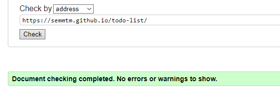

### CSS 
No errors when passing the stylesheet through the validator.

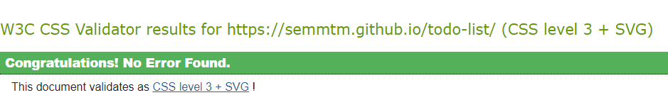

### JavaScript 
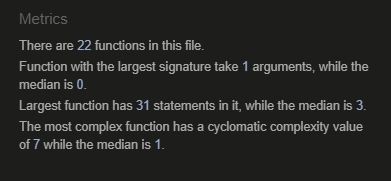

### 5.5 Accessibility 
The to-do list was tested by the WAVE Web Accessibility Evaluation Tool.

WAVE Report - index.html

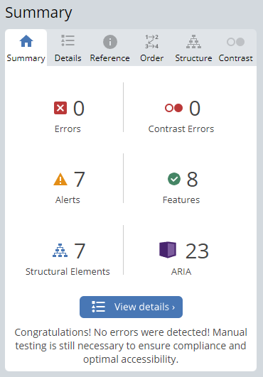

WAVE Contrast Report - index.html

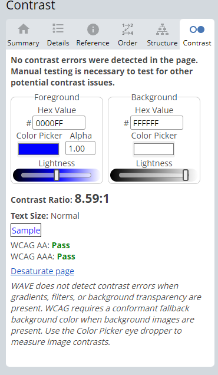

## 5.6. Google Lighhouse Testing
### Desktop
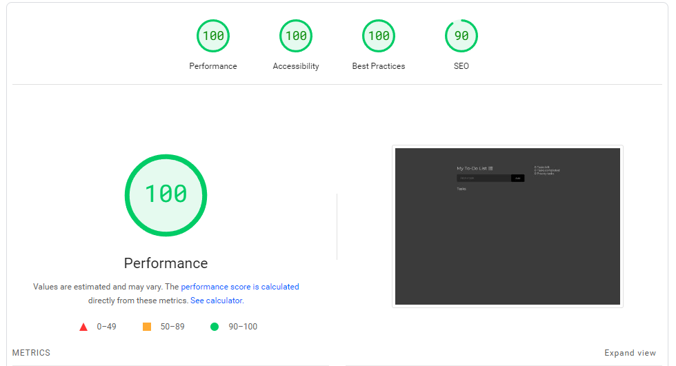

### Mobile
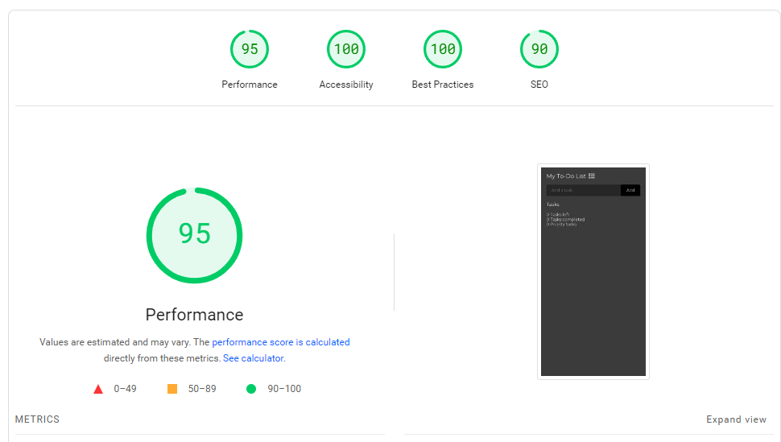

## 6. Bugs
### Fixed Bugs 
- After deployment the complete task notification sound was not playing. I had .. at the start of the file path name for the audio file. I changed this to . and it fixed the issue.
- The editable title was not showing on the iphone browser on the deployed version of the app. I believe this issue was happening due to compatability issues with a h1 having the contenteditable attribute. To fix this, I changed the h1 to a p element and added a function that will push a default title if the #mainTitle element is empty. 

### Unfixed Bugs
- No unfixed bugs on the final deployment

## 7. Credits

### 7.1. Content & Resources
- How to clear a text field using JS: https://stackoverflow.com/questions/14837466/clearing-a-text-field-on-button-click
- Used for help on how to add an HTML element is a class list: https://www.shecodes.io/athena/3913-how-to-add-a-class-to-an-html-element-in-javascript#:~:text=In%20JavaScript%2C%20you%20can%20add,class%20to%20the%20classList%20property.&text=This%20code%20retrieves%20the%20element,myClass"%20to%20the%20classList%20property.
- How to set a HTML attribute via JavaScript: https://www.w3schools.com/jsref/met_element_setattribute.asp
- How to use toggle event: https://www.w3schools.com/howto/howto_js_toggle_class.asp
- How to use the event property: https://www.w3schools.com/jsref/event_target.asp
- Code for adding a task on enter click is from the 'Love Maths' project
- How to get sound to play on click event: https://www.youtube.com/watch?v=0R6rZngcHGg
- How to calculate the difference between two dates in days: https://stackoverflow.com/questions/2627473/how-to-calculate-the-number-of-days-between-two-dates
- How to convert dates from string format to date format: https://www.turing.com/kb/converting-string-to-date-in-js
- Using parseInt to convert a value into a number: https://stackoverflow.com/questions/17388503/how-to-save-a-number-into-localstorage-that-increments-each-time-the-user-enters
- How to save data locally: https://www.geeksforgeeks.org/how-to-save-data-in-local-storage-in-javascript/

### 7.2. Media
- Font awesome icon used: https://fontawesome.com/icons/list?f=classic&s=solid

### 7.3. Acknowledgements
> My mentor Alan Bushell, who provided amazing constructive feedback and clear areas for improvement to improve the entire project.
> I had help from a Code Institute tutor who helped me create unqiue task Ids and parse data to needed elements.

## 8. Deployment
- The app was deployed to Github pages. The steps to deploy are as follows:
 1. In the GitHub respository, navigate to the setting tab
 2. From the source section drop-down menu, select the 'Master' or 'Main' branch
 3. Once the 'Main' branch has been selected, the page will provide a link to the completed site once it finishes deployment

 Live Link: https://semmtm.github.io/todo-list/

### How to cloan the app
The steps to cloan this repository are as follows:
- Find the respoitory on my Github Page. Link: https://github.com/SemMTM/todo-list
- Copy the URL
- Open a new terminal window, and run the git clone command with the URL. This will create a new directory call repository-name.
- Once cloaned, run the git pull command in the repository directory
- This will pull any updates from the upstream repository, which you can then merge into your local working copy.
