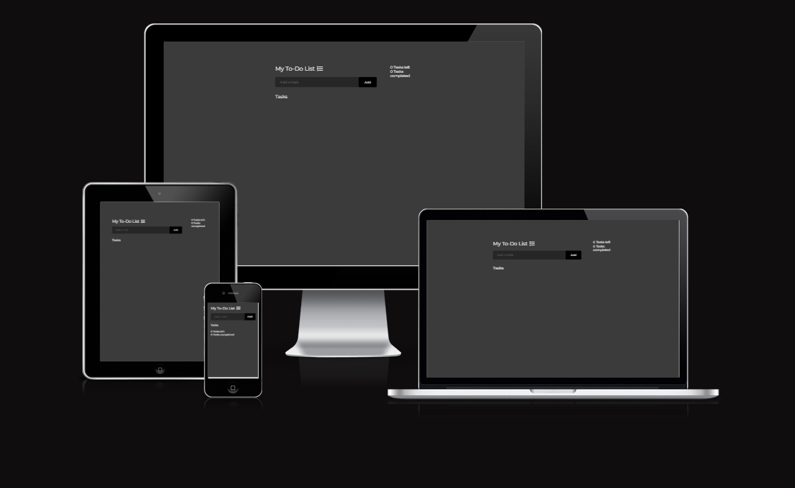
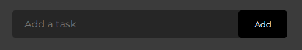
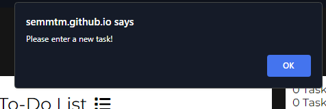
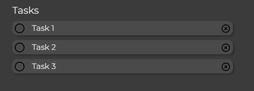
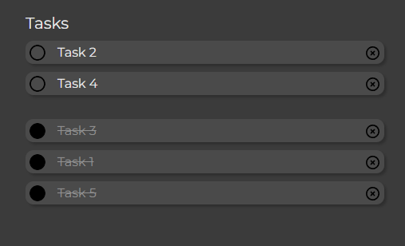
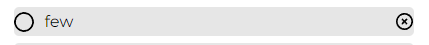
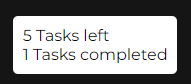
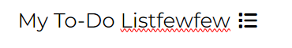
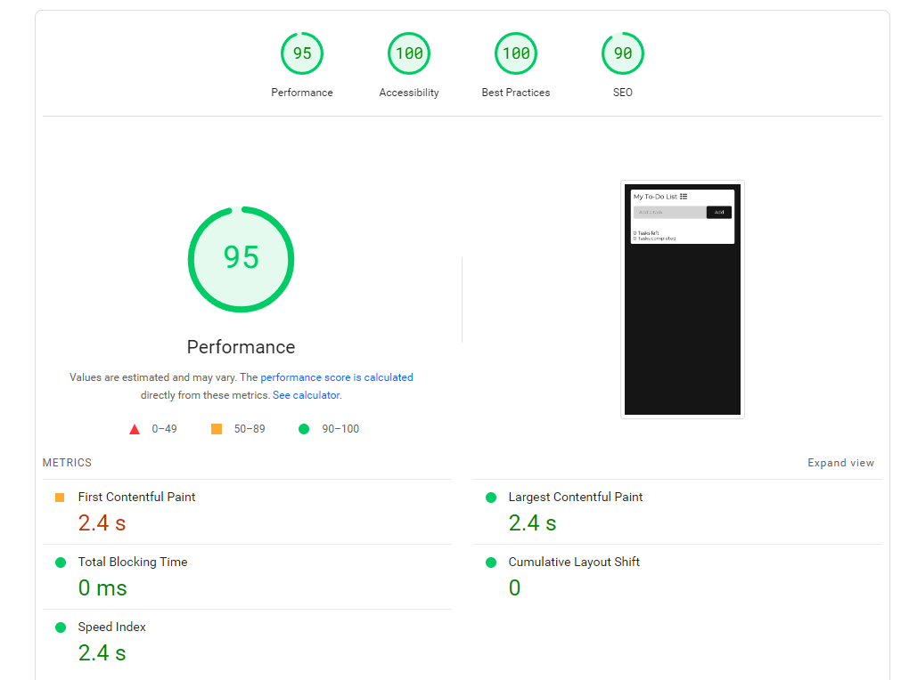

# To-Do List
To-Do List is a JavaScript web app that is a simple yet effective way to track tasks that need to be done and can be easily used by anyone for any tasks. It is simple by design for 2 reasons: 
 - A To-Do list is something that does not need to be overly complicated. The focus should be on the tasks that need completeing.
 - It can be easily used by anyone, regardless of technical ability.
 
The purpose of this app is to allow a user to easily keep track of tasks that they need to complete, see the tasks they have completed and get a sense of accomplishment from the "ding" after each task completion. They can also see a score which shows the tasks remaining and the completed tasks.

Live link: https://semmtm.github.io/todo-list/

## Features
### Adding Tasks to the Task List
- A large text input field that allows the user to enter a new task to add to the 'incomplete' task list.

- An error is displayed if the field is left empty.

- When a task is entered, the DOM is then updated with the task that the user entered. It is added to a 'incomplete tasks' list. These tasks can be added by clicking 'add' or by pressing enter. Once the task has been added, the 'add a task' field is cleared.

- A cursor pointer is shown when a task is hovered over.

### Task Completion and Task Delete

- Tasks can be marked as complete by clicking anywhere on the task. Once a task is marked as complete, it is moved to a 'completed' list and moved to the bottom of the list for organisation. Tasks marked as complete are also lined through, greyed out, the circle is filled in and a 'ding' sound is played to add a sense of acomplishment at your recently completed task.

- Tasks can also be unchecked. Once a task is unchecked, it is added to the bottom of the incomplete task list. The score also updates accordingly.

- Tasks can be completely deleted by pressing a small 'x' on the side of every task. This will completely delete the specific task from any list it was on and update the score accordingly.

### Tasks Score

- A score tracker updates when tasks are added or marked as complete. This helps the user easily see how many tasks are remaining and how many they have completed.

- If a task is deleted from either list, then the tracker updates.

 

### Editable Title

- The title of the to do list is editable by the user so they can make it their own. 
- If the field is empty, then a default 'My To-Do List' title is used.

### Save Data Locally 

- Remaining tasks and the custom title name are saved to the browser locally so that a user can return to their tasks without needing to retype everything.

- Completed tasks are not saved so the list is tidyed up when the user next returns.

### Response To The User

- Almost every interaction a user makes with the To-Do list provides some sort of feedback. Most notibly, when a task is marked as complete a 'ding' sound will play. The purpose for this is to invoke a strong positive response from the user and encourange them to add and complete more tasks.

## Features I Would Like To Add 
- The ability to create additional lists for seperate groups of tasks 
- Add reminders to tasks 
- Reorder tasks 

## Testing 
### General Testing
- I have tested the site on multiple browsers: Chrome, Safari(mobile) and Opera 
- I have confirmed that the project is responsive on different screen sizes
- All text is easy to read on all pages and screen sizes
- All forms have client side validation and need information in before they can be submnitted
- All forms submit correctly
- Tasks are added to the list on enter or button click
- Tasks counter updates when tasks state changes
- Task delete works correctly
- Tasks are put into the correct list depending on if they are complete or not
- Local data save and retrieval work as intended
- Task auto ordering works correctly 
- Task complete notificaction plays when intended
- Title can be edited and is saved after any action

### Validator Testing
- HTML - No errors when passing code through the W3C validator 
- CSS - No errors when passing the stylesheet through the validator
- JacaScript 
  - No errors when passing script.js through the Jshint validator
    - The following metrics were returned:
    - There are 11 functions in this file.
    - Function with the largest signature take 1 arguments, while the median is 0.
    - Largest function has 21 statements in it, while the median is 3.
    - The most complex function has a cyclomatic complexity value of 4 while the median is 1.
- Accessibility - Fonts and colors used are easily to read and accessibility has been tested on google speed test

## Bugs
### Fixed Bugs 
- After deployment the complete task notification sound was not playing. I had .. at the start of the file path name for the audio file. I changed this to . and it fixed the issue.
- The editable title was not showing on the iphone browser on the deployed version of the app. I believe this issue was happening due to compatability issues with a h1 having the contenteditable attribute. To fix this, I changed the h1 to a p element and added a function that will push a default title if the #mainTitle element is empty. 

### Unfixed Bugs
- No unfixed bugs on the final deployment

## Credits

### Code
- How to clear a text field using JS: https://stackoverflow.com/questions/14837466/clearing-a-text-field-on-button-click
- Used for help on how to add an HTML element is a class list: https://www.shecodes.io/athena/3913-how-to-add-a-class-to-an-html-element-in-javascript#:~:text=In%20JavaScript%2C%20you%20can%20add,class%20to%20the%20classList%20property.&text=This%20code%20retrieves%20the%20element,myClass"%20to%20the%20classList%20property.
- How to set a HTML attribute via JavaScript: https://www.w3schools.com/jsref/met_element_setattribute.asp
- How to use toggle event: https://www.w3schools.com/howto/howto_js_toggle_class.asp
- How to use the event property: https://www.w3schools.com/jsref/event_target.asp
- Code for adding a task on enter click is from the 'Love Maths' project
- How to get sound to play on click event: https://www.youtube.com/watch?v=0R6rZngcHGg

### Media
- Font awesome icon used: https://fontawesome.com/icons/list?f=classic&s=solid

## Deployment
- The app was deployed to Github pages. The steps to deploy are as follows:
 - In the GitHub respository, navigate to the setting tab
 - From the source section drop-down menu, select the 'Master' or 'Main' branch
 - Once the 'Main' branch has been selected, the page will provide a link to the completed site once it finishes deployment

 Live Link: https://semmtm.github.io/todo-list/

### How to cloan the app
The steps to cloan this repository are as follows:
- Find the respoitory on my Github Page. Link: https://github.com/SemMTM/todo-list
- Copy the URL
- Open a new terminal window, and run the git clone command with the URL. This will create a new directory call repository-name.
- Once cloaned, run the git pull command in the repository directory
- This will pull any updates from the upstream repository, which you can then merge into your local working copy.
