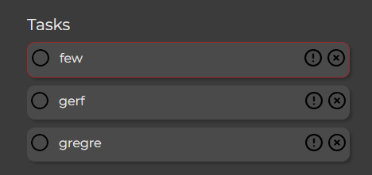
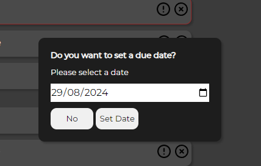

# Simple To-Do List

## A To-Do List Web Appication
Simple To-Do List is a JavaScript web app that is a simple yet effective way to track tasks that need to be done and can be easily used by anyone for any tasks. It is simple by design for 2 reasons: 
 - A To-Do list is something that does not need to be overly complicated. The focus should be on the tasks that need completeing.
 - It can be easily used by anyone, regardless of technical ability.
 
The purpose of this app is to allow a user to easily keep track of tasks that they need to complete, see the tasks they have completed and get a sense of accomplishment from the "ding" after each task completion. They can see scores which indicate the tasks remaining, the completed tasks and the number of priority tasks.

#### Live site: https://semmtm.github.io/todo-list/
#### Repository: https://github.com/SemMTM/todo-list

### By Osama Hendawi

## Table of Contents
1.
2.
3.

## UX
### Pre-project Planning
For project 2 I decided I wanted to challenge myself and create something that was'nt in one of the suggested projects. I came to the idea of a to-do list as this is something I use regularly and it would really test my abilities with JavaScript as I have not done anything like this previously.

There were a few main things I wanted this to-do list to have:

- A due date and priority tasks feature
- Counters to show remaining tasks
- Save task data locally so the user does no have to re-enter their tasks each time 

### UX Design
In terms of user experince, I really wanted to keep things as clean as possible. I wanted the task list to be efficient, easy to use, clean and organised for the user. I wanted the colours to be more neutral and not distracting, I wanted a font that would be easily legible and poisitve feedback for task completion. Some other considerations were:  

- There had to be a clear distinction between completed and incomplete tasks
- Priority tasks had to be obvious 
- Simplicity was to be the main priority in terms of design

## User Stories 
### User
- As a user I want to be able to keep an organised list of tasks that need doing
- As a user I want to be able to set due dates for important tasks that need doing first. I also want a clear indication of when these tasks are due and how long I have left to complete them
- As a user I want to be able to mark tasks as priority
- I want to be able to delete tasks and mark them as complete

## Wireframes
### Desktop & Mobile Wireframes

## Features
### Adding Tasks to the Task List
- A large text input field that allows the user to enter a new task to add to the 'incomplete' task list.

- An error is displayed if the field is left empty.

- When a task is entered, the DOM is then updated with the task that the user entered. It is added to a 'incomplete tasks' list. These tasks can be added by clicking 'add' or by pressing enter. Once the task has been added, the 'add a task' field is cleared.

- A cursor pointer is shown when a task is hovered over.

### Task Completion and Task Delete

- Tasks can be marked as completed by clicking anywhere on the task. Once a task is marked as complete, it is moved to a 'completed' list and moved to the bottom of the list for organisation. Tasks marked as complete are also lined through, greyed out, the circle is filled in and a 'ding' sound is played to add a sense of acomplishment at your recently completed task.

- Tasks can also be unchecked. Once a task is unchecked, it is added to the bottom of the incomplete task list. The score also updates accordingly.

- Tasks can be completely deleted by pressing a small 'x' on the side of every task. This will completely delete the specific task from any list it was on and update the score accordingly.

### Priority Tasks & Set Due Date
- Tasks can be marked as priority by selecting the exclamation point. When tasks are marked as priority, they will be moved to the top of the task list, added to the 'priority tasks' counter and outlined in red.

- After pressing this priority button, a pop-up will appear. This pop-up asks the user if they wish to set a due date. The reason I have implemented this feature in such as way is that I wanted to allow the user to set priority tasks, as well as a due date and I did not want to add another separate button. This would cause the to do list to become overly cluttered and would not align with keeping it as clean as possible.

- If they select no, then the task will be marked as priority, if they select a date and click 'set date' then a due date will appear below the task. This date has been formatted to be more readable for the user.

- This due date counter updates as the due date gets closer and the message changes depeneding on if the task is overdue or due soon. Tasks that are due soon will be moved to the top of the task list. The colour of the due message will change depending on how close the due date is.

- If no date is selected and the user hits 'set date', then they will recieve an error message.

- To implement this live due date tracker, I had to use a for loop to iterate through all of the tasks in the 'incomplete' tasks list. It would then check the user set date and compare it to todays date. Different actions will then be called depending on how close or far the due date is.

### Tasks Score

- A score tracker updates when tasks are added, marked as complete or marked as priority. This helps the user easily see how many tasks are remaining and how many they have completed.

- If a task is deleted from either list, then the tracker updates.

 

### Editable Title

- The title of the to do list is editable by the user so they can make it their own. 
- If the field is empty, then a default 'My To-Do List' title is used.

### Save Data Locally 

- Remaining tasks and the custom title name are saved to the browser locally so that a user can return to their tasks without needing to retype everything.

- Completed tasks are not saved so the list is tidyed up when the user next returns.

### Response To The User

- Almost every interaction a user makes with the To-Do list provides some sort of feedback. Most notibly, when a task is marked as complete a 'ding' sound will play. The purpose for this is to invoke a strong positive response from the user and encourange them to add and complete more tasks.

## Future Features
- The ability to create additional lists for seperate groups of tasks 
- Reorder tasks via click and drag or drag and drop

## Technology Used
### HTML
Used to structure my webpage.

### CSS
Used to style and layout the To-do List.

### JavaScript
Used to add all of the interactivity to the site, update the DOM based on what the user wants to do with their task, update the live counter, add the due dates, set priority tasks etc.

### Font Awesome
Used for the title icon.

## Testing 
### General Testing
- I have tested the site on multiple browsers: Chrome, Safari(mobile) and Opera 
- I have confirmed that the project is responsive on different screen sizes
- All text is easy to read on all pages and screen sizes
- All forms have client side validation and need information in before they can be submnitted
- All forms submit correctly
- Tasks are added to the list on enter or button click
- Tasks counter updates when tasks state changes
- Task delete works correctly
- Tasks are put into the correct list depending on if they are complete or not
- Local data save and retrieval work as intended
- Task auto ordering works correctly 
- Task complete notificaction plays when intended
- Title can be edited and is saved after any action

### Validator Testing
- HTML - No errors when passing code through the W3C validator 
- CSS - No errors when passing the stylesheet through the validator
- JacaScript 
  - No errors when passing script.js through the Jshint validator
    - The following metrics were returned:
    - There are 11 functions in this file.
    - Function with the largest signature take 1 arguments, while the median is 0.
    - Largest function has 21 statements in it, while the median is 3.
    - The most complex function has a cyclomatic complexity value of 4 while the median is 1.
- Accessibility - Fonts and colors used are easily to read and accessibility has been tested on google speed test

## Bugs
### Fixed Bugs 
- After deployment the complete task notification sound was not playing. I had .. at the start of the file path name for the audio file. I changed this to . and it fixed the issue.
- The editable title was not showing on the iphone browser on the deployed version of the app. I believe this issue was happening due to compatability issues with a h1 having the contenteditable attribute. To fix this, I changed the h1 to a p element and added a function that will push a default title if the #mainTitle element is empty. 

### Unfixed Bugs
- No unfixed bugs on the final deployment

## Credits

### Code Help
- How to clear a text field using JS: https://stackoverflow.com/questions/14837466/clearing-a-text-field-on-button-click
- Used for help on how to add an HTML element is a class list: https://www.shecodes.io/athena/3913-how-to-add-a-class-to-an-html-element-in-javascript#:~:text=In%20JavaScript%2C%20you%20can%20add,class%20to%20the%20classList%20property.&text=This%20code%20retrieves%20the%20element,myClass"%20to%20the%20classList%20property.
- How to set a HTML attribute via JavaScript: https://www.w3schools.com/jsref/met_element_setattribute.asp
- How to use toggle event: https://www.w3schools.com/howto/howto_js_toggle_class.asp
- How to use the event property: https://www.w3schools.com/jsref/event_target.asp
- Code for adding a task on enter click is from the 'Love Maths' project
- How to get sound to play on click event: https://www.youtube.com/watch?v=0R6rZngcHGg
- How to calculate the difference between two dates in days: https://stackoverflow.com/questions/2627473/how-to-calculate-the-number-of-days-between-two-dates
- How to convert dates from string format to date format: https://www.turing.com/kb/converting-string-to-date-in-js

### Media
- Font awesome icon used: https://fontawesome.com/icons/list?f=classic&s=solid

## Deployment
- The app was deployed to Github pages. The steps to deploy are as follows:
 - In the GitHub respository, navigate to the setting tab
 - From the source section drop-down menu, select the 'Master' or 'Main' branch
 - Once the 'Main' branch has been selected, the page will provide a link to the completed site once it finishes deployment

 Live Link: https://semmtm.github.io/todo-list/

### How to cloan the app
The steps to cloan this repository are as follows:
- Find the respoitory on my Github Page. Link: https://github.com/SemMTM/todo-list
- Copy the URL
- Open a new terminal window, and run the git clone command with the URL. This will create a new directory call repository-name.
- Once cloaned, run the git pull command in the repository directory
- This will pull any updates from the upstream repository, which you can then merge into your local working copy.
